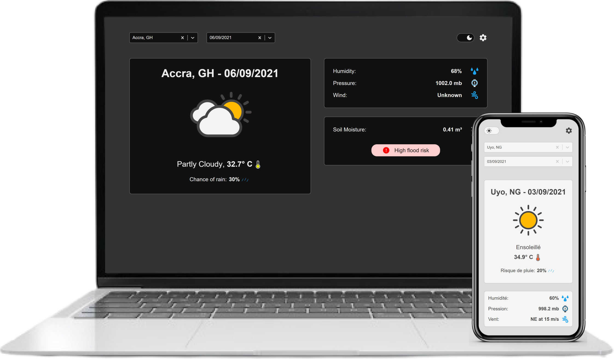

<h1 align="center">
  
</h1>

  <a href="#-technologies">Technologies</a>&nbsp;&nbsp;&nbsp;|&nbsp;&nbsp;&nbsp;
  <a href="#-projeto">Project</a>&nbsp;&nbsp;&nbsp;|&nbsp;&nbsp;&nbsp;
  <a href="#-how-to-execute">How to execute</a>

 

  

## 🧪 Technologies

This project was developed with the following technologies:

- [React](https://reactjs.org)
<!-- - [Sass](https://sass-lang.com/) -->

## 💻 Project

Weather forecasts UI dashboard.

## 🚀 How to execute

- Clone this repository
- Instalt the dependencies with `yarn`
- Initialize the server with `yarn start`

Now you can access [`localhost:3000`](http://localhost:3000) in your browser.

---

<h4 align="center"> Made with ♥ by Marcelino Teixeira and Laisa Costa </h4>